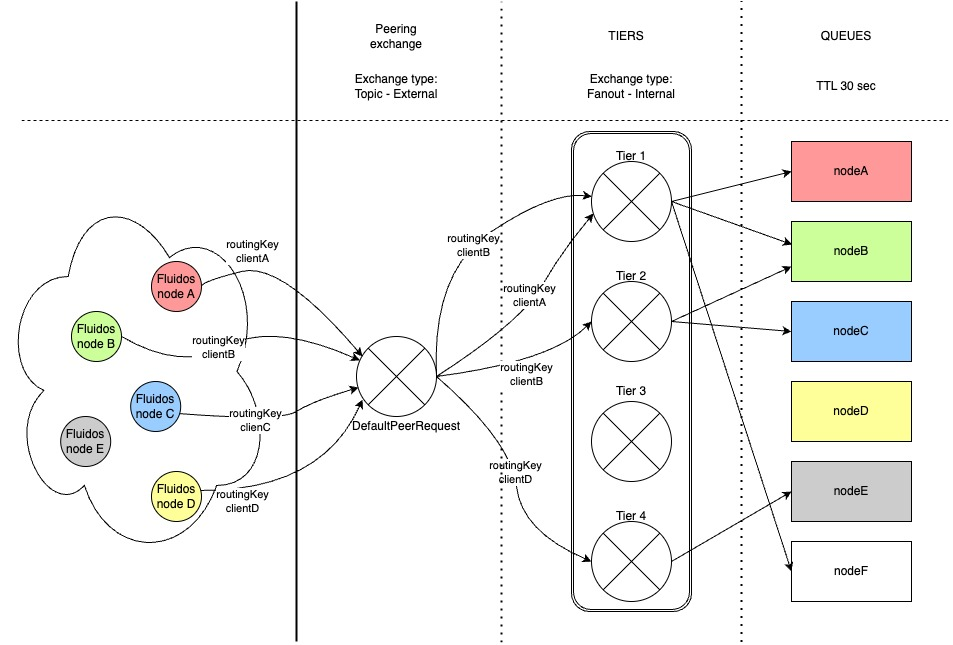

<!-- markdownlint-disable first-line-h1 -->

<h3 align="center">FLUIDOS Broker</h3>

  

# WAN Discovery – RabbitMQ Configuration Guide

This repository provides an example of configuration to set up a RabbitMQ message broker for WAN-based discovery of FLUIDOS Nodes.

## Prerequisites

A vanilla RabbitMQ installation is required on your server.  
Refer to the official <a href="https://www.rabbitmq.com/docs/configure"> RabbitMQ Configuration </a> to determine the correct location of the rabbitmq.conf file based on your system.

The provided `rabbitmq.conf` is an example of configuration to enforce TLS peer authentication. It configures RabbitMQ to use the default SSL port 5671 and disables the non-SSL TCP port 5672. The configuration also sets the Common Name (CN) of the SSL certificate as the authentication ID, additionally, it restricts access to the Management UI and `rabbitmqadmin` tools to localhost, enhancing the system’s security by limiting administrative access to the local machine only.  
To enable TLS-based authentication, activate the RabbitMQ TLS authentication plugin:  
`rabbitmq-plugins enable rabbitmq_auth_mechanism_ssl`

## Certificate Issuance

To enable TLS-based authentication, you must generate the self-signed root certificate and a server certificate issued by the root certificate.  
We use RSA 2048-bit encryption, and example configurations are provided below.

    openssl req -x509 -newkey rsa:2048 -keyout CA_privKey.pem -out CA_cert.pem -days 365 -config CA.conf

    openssl x509 -req -in serverCert/server.csr -CA CAcert/CA_cert.pem -CAkey CAcert/CA_privKey.pem -CAcreateserial -out serverCert/server_cert.pem -days 365 -sha256 -extfile serverCert/server.conf -extensions v3_req

## User & Queue Configuration

Some scripts rely on `rabbitmqadmin`, so ensure that an administrator user is properly configured and that the default "guest" user is restricted to localhost access only.  
  
The `setup.sh` script automates the setup of queues, permissions, exchanges, and bindings as defined in `users.yaml`.
Client certificates and private keys, ensuring each client can authenticate securely.  
  
The `eraseRabbit.sh` script removes all queues, bindings, exchanges, and users, except for the default "guest" user, ensuring continued access via `rabbitmqadmin`.  
  
The `deleteUserBindings.sh` script removes all the bindings for the user passed as argument.  
  
Once the setup is over it it is possible to refine the configuration with specific `rabbitmqctl` and `rabbitmqadmin` commands to create more bindings.  
Previously issued certificates will continue to function as expected.

## Message Routing 

Clients publish messages to two separate exchanges: one for `announcements` and another for `rules`. A `rule` is a dictionary that defines the criteria a client uses to specify which types of announcement messages it is interested in. Both `rules` and `announcements` are configured through json files that can be provided to the broker generation script in the FLUIDOS node's `Network Manager`.

Each client is subscribed to a dedicated private queue, which receives messages routed through the `routing_exchange`.

The routing process is managed by the `router` component, which consists of two distinct objects running in separate threads: `routing_manager` and `rules_manager`. Each of these components subscribes to its respective queue.

When an announcement message arrives, the `routing_manager` evaluates it against every stored rule across all clients. If a rule matches, the name of the client that defined the rule is appended to the `routing key` of the announcement message. This mechanism ensures that the message is delivered to all client queues interested in announcements that meet their specified criteria.

The matching process is configurable via the `metrics_comparators`, which define the comparison logic used to determine whether an announcement satisfies a given rule.

### A simple scheme that illustrates the broker architecture

