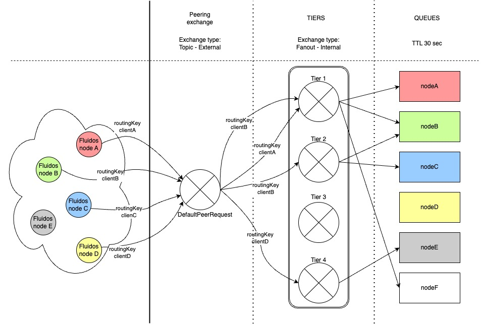

<!-- markdownlint-disable first-line-h1 -->

<h3 align="center">FLUIDOS Broker</h3>

  

# WAN Discovery – RabbitMQ Configuration Guide

This repository provides an example of configuration to set up a RabbitMQ message broker for WAN-based discovery of FLUIDOS Nodes.

## Prerequisites

A vanilla RabbitMQ installation is required on your server.  
Refer to the official <a href="https://www.rabbitmq.com/docs/configure"> RabbitMQ Configuration </a> to determine the correct location of the rabbitmq.conf file based on your system.

The provided `rabbitmq.conf` configuration enforces TLS peer authentication for both client and server communications. It configures RabbitMQ to use the default SSL port 5671 and disables the non-SSL TCP port 5672. The configuration also sets the Common Name (CN) of the SSL certificate as the authentication ID, additionally, it restricts access to the Management UI and `rabbitmqadmin` tools to localhost, enhancing the system’s security by limiting administrative access to the local machine only.  
To enable TLS-based authentication, activate the RabbitMQ TLS authentication plugin:  
`rabbitmq-plugins enable rabbitmq_auth_mechanism_ssl`

## Certificate Issuance

To enable TLS-based authentication, you must generate the self-signed root certificate and a server certificate issued by the root certificate.  
We use RSA 2048-bit encryption, and example configurations are provided below.

    openssl req -x509 -newkey rsa:2048 -keyout CA_privKey.pem -out CA_cert.pem -days 365 -config CA.conf

    openssl x509 -req -in serverCert/server.csr -CA CAcert/CA_cert.pem -CAkey CAcert/CA_privKey.pem -CAcreateserial -out serverCert/server_cert.pem -days 365 -sha256 -extfile serverCert/server.conf -extensions v3_req

## User & Queue Configuration

Some scripts rely on `rabbitmqadmin`, so ensure that an administrator user is properly configured and that the default "guest" user is restricted to localhost access only.  

Users are defined in `users.yaml` and created via `setup.sh` along with their permissions.  
Each client has a dedicated queue receiving messages from `routing_exchange` and publishes to `advertisement_exchange` (aggregates node IPs) and `rules_exchange` (informs the broker of filtering criteria). Messages are routed accordingly.

`LocalAgent` consists of two classes: `RulesManager` managing rules, and `RoutingManager` managing the advertisements. 

`metrics.sh` updates node latency to every known client every 2 minutes in `metrics.yaml` and `RoutingManager` reads this to generate routing keys. If a client IP changes it updates both the file and the bindings.  

Before the `RulesManager` sets up bindings, an ERP API validates client access to specific data.  

Client authentication is secured via certificates.  

`eraseRabbit.sh` removes all queues, bindings, exchanges, and users, except guest, and `deleteUserBindings.sh` removes all bindings for a given client.  

After setup, additional bindings can be configured via rabbitmqctl/rabbitmqadmin.  
Previously issued certificates remain valid.

## Message format and routing

Two types of messages are published on the exchanges.  
The announcement contains the FLUIDOS node ID, including the IP. 

The rule is a string representing the latency, bandwidth and geographical zones desired by the sender: the format is like:  
`100.1.K-Z-J`  
Where 100 is the maximum latency accepted in milliseconds, 1 is the minimum bandwidth accepted in Mbps and K, Z, J represent some geographical zones.  

This rule is translated to three different bingding keys that will be applied with `rabbitmqctl`:     
    - 100.1.K  
    - 100.1.Z  
    - 100.1.J  
If any message from the announcements has a routing key matching one of these bindings, that message will be routed to the queue of the client which sent the rule.

### A schema that illustrates broker's architecture

## Directory structure example compatible for setup.sh

    ~/
    ├─ CAcert/
    │  ├─ CA.conf
    │  ├─ CA_privKey.pem
    │  ├─ CA_cert.pem
    ├─ clientCert/
    │  ├─ clientA_priv.pem
    │  ├─ clientA_cert.pem
    │  ├─ clientB_priv.pem
    │  ├─ clientB_cert.pem
    │  ├─ client.conf
    │  ├─ clientA_request.csr
    │  ├─ clientB_request.csr
    ├─ serverCert/
    │  ├─ server_cert.pem
    │  ├─ server_privKey.pem
    │  ├─ server.conf
    │  ├─ server.csr
    ├─ users.yaml
    ├─ setup.sh
    ├─ cert_gen.sh
    ├─ eraseRabbit.sh
    ├─ deleteUserBindings.sh
    ├─ router/
    │  ├─ metrics.sh
    │  ├─ metrics.yaml
    │  ├─ router.py
    │  ├─ routingRules.yaml
